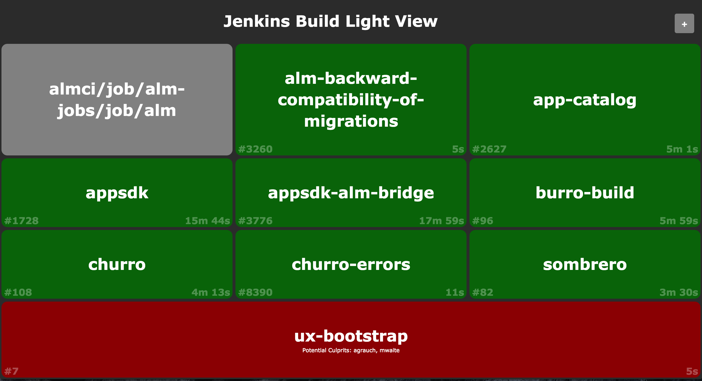

# Jenkins Build Light

[](https://hub.docker.com/r/coldpour/jenkins-build-light/)
[](https://waffle.io/coldpour/jenkins-build-light)

## About
Webapp that displays the status of several jenkins jobs even across multiple servers.



## Usage

### Light Colors

* Green - last build succeeded
* Red - last build failed
* Grey - one of: last build was aborted, build is disabled, build has never runcli
* Flashing - build is in progress

### Add Build Lights

Each build that you add will add a light to the grid that polls the jenkins server every 5 seconds for updates.

* Click the plus button in the top right corner.
* In the input box that appears, type the url of the job you want the light to track.
* Either hit Enter or click the plus button again.

### Remove Build Lights

Sometimes a light is no longer interesting, or you messed up the URL when you added it.

* Hover over a build light until an 'x' appears in the top right corner of the light.
* Click the 'x'.

### Save or Share a View

The lights you've added get put up in the URL, so to save the View you've set up, simply bookmark the page and it will load the same lights next time. To share your view, copy and paste the URL.

## To Hack

```bash
git clone https://github.com/coldpour/jenkins-build-light.git
cd jenkins-build-light
npm install
npm run dev
```

Then visit [http://localhost:8080](http://localhost:8080).

After you make changes, press CTRL+C and rerun `npm run dev`.

## To Run In Prod

In prod mode, logging is funneled to the `logs` directory.

Simpley use `npm start` instead of `npm run dev`.

```bash
git clone https://github.com/coldpour/jenkins-build-light.git
cd jenkins-build-light
npm install
npm start
```

`npm stop` and `npm restart` will stop or bounce the server.
