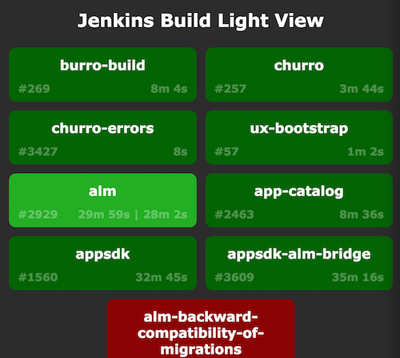

# Jenkins Build Light

Webapp that displays the status of several jenkins jobs even across multiple servers.



## Usage

### Light Colors

* Green - last build succeeded
* Red - last build failed
* Grey - one of: last build was aborted, build is disabled, build has never runcli
* Flashing - build is in progress

### Add Build Lights

Each build that you add will add a light to the grid that polls the jenkins server every 5 seconds for updates.

* Click the plus button in the top right corner.
* In the input box that appears, type the url of the job you want the light to track.
* Either hit Enter or click the plus button again.

### Remove Build Lights

Sometimes a light is no longer interesting, or you messed up the URL when you added it.

* Hover over a build light until an 'x' appears in the top right corner of the light.
* Click the 'x'.

### Save or Share a View

The lights you've added get put up in the URL, so to save the View you've set up, simply bookmark the page and it will load the same lights next time. To share your view, copy and paste the URL.

## To Hack

```bash
git clone https://github.com/coldpour/jenkins-build-light.git
cd jenkins-build-light
npm install
bin/proxy &
npm start
```

Then visit http://localhost:8080/webpack-dev-server/bundle.

This runs the webpack dev server, any changes you make to javascript or css
files in `src` will cause the browser to reload live. The proxy server code
will not live reload however, so any changes you make there will need to bounce the proxy.

The app will also be hosted at http://localhost:8080, but it won't receive live updates.

## Configuration

For the moment, all configuration lives in `src/app/Constants.js`.

### PROXY
To set up a server that other people can connect to, you'll need to change the `PROXY` to either an IP or a DNS hostname. Leaving the `PROXY=http://localhost` will pretty much only work for local development.
